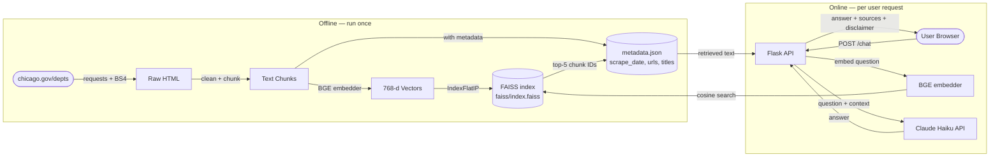
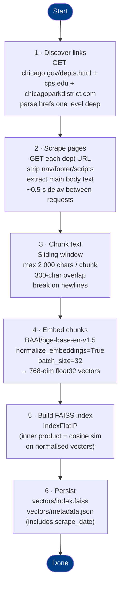
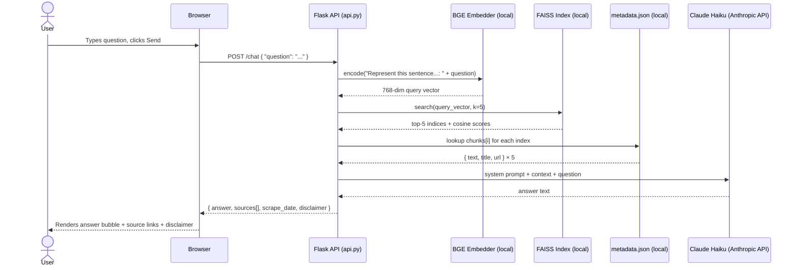
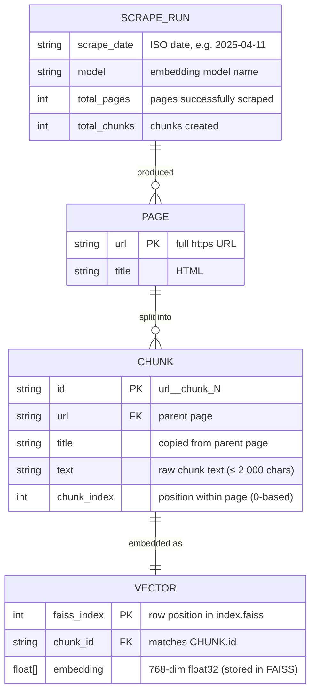

# Chicago City Services RAG Chatbot

A Retrieval-Augmented Generation (RAG) chatbot that lets users ask plain-English
questions about Chicago city services. Knowledge comes from a one-time scrape of:

- `chicago.gov/city/en/depts.html` — all city department pages
- `cps.edu` — Chicago Public Schools (up to 60 pages, one level from home)
- `chicagoparkdistrict.com` — Chicago Park District (up to 60 pages, one level from home)

Every answer carries a disclaimer with the exact scrape date so users know when
the data was last captured.

---

## Table of Contents

1. [Architecture Overview](#architecture-overview)
2. [Data Pipeline DAG](#data-pipeline-dag)
3. [Request / Response Flow](#request--response-flow)
4. [Data Model](#data-model)
5. [Project Structure](#project-structure)
6. [Setup & Running](#setup--running)
7. [Cost Model](#cost-model)
8. [Design Decisions](#design-decisions)
9. [Limitations & Future Work](#limitations--future-work)

---

## Architecture Overview



**Key principle:** The LLM (Claude) never touches the internet at inference time.
It only sees text that was retrieved from your local FAISS index.

---

## Data Pipeline DAG

Steps that run when you execute `python scrape_and_index.py`.



---

## Request / Response Flow

Sequence of calls for a single user question.



---

## Data Model

The project uses two flat files rather than a database. The ER diagram below
shows the logical relationships between the entities they contain.



> **Storage layout**
> - `SCRAPE_RUN`, `PAGE`, and `CHUNK` entities live in `vectors/metadata.json`
> - `VECTOR` embeddings live in `vectors/index.faiss`
> - Row order in `index.faiss` matches the order of `chunks[]` in `metadata.json`

---

## Project Structure

```
govt services chatbot/
├── scrape_and_index.py   ← one-time data pipeline (run before first use)
├── api.py                ← Flask backend + RAG logic
├── static/
│   └── index.html        ← two-column chat UI (vanilla JS): left info panel (1/3) + right chat (2/3)
├── vectors/              ← created by scrape_and_index.py
│   ├── index.faiss       ← FAISS vector index
│   └── metadata.json     ← scrape date, chunk text, source URLs
├── conversations.db      ← SQLite conversation log (auto-created on first run)
├── requirements.txt
├── .env                  ← ANTHROPIC_API_KEY (not committed)
├── .env.example
└── project_overview.md   ← this file
```

---

## Setup & Running

### 1 · Install dependencies

```bash
python -m venv .venv
source .venv/bin/activate       # Windows: .venv\Scripts\activate
pip install -r requirements.txt
```

### 2 · Add your API key

```bash
cp .env.example .env
# edit .env and set ANTHROPIC_API_KEY=sk-ant-...
```

### 3 · Scrape & index (run once)

```bash
python scrape_and_index.py
```

This downloads ~40 pages from chicago.gov plus up to 60 pages each from
cps.edu and chicagoparkdistrict.com, chunks and embeds them, and writes
`vectors/index.faiss` + `vectors/metadata.json`. Takes 5–10 minutes on first
run (model download + scraping). Subsequent re-runs are faster (page cache is reused).

### 4 · Start the API server

```bash
python api.py
# → http://localhost:5000
```

### 5 · Open the chat UI

Navigate to [http://localhost:5000](http://localhost:5000) in your browser.

---

## Cost Model

| Component | Cost |
|---|---|
| Embeddings (scrape + queries) | **$0** — local BGE model |
| Vector search (FAISS) | **$0** — local in-memory |
| Claude Haiku — input (~3 200 tok/query) | ~$0.0026/query |
| Claude Haiku — output (~250 tok/query) | ~$0.001/query |
| **Per query total** | **~$0.0036** |

At 100 visitors/week averaging 3 questions each:

| Period | Queries | API cost |
|---|---|---|
| Week | 300 | ~$1.08 |
| Month | 1 300 | ~$4.68 |

Hosting (optional): $0 locally, ~$5–7/month on a small VPS (Render, Railway,
DigitalOcean).

---

## Design Decisions

| Decision | Choice | Reason |
|---|---|---|
| Embedding model | `BAAI/bge-base-en-v1.5` | Top MTEB retrieval score among free local models; 440 MB; no extra API key |
| BGE query prefix | `"Represent this sentence for searching relevant passages: "` | Required by BGE for asymmetric retrieval (query ≠ passage) |
| Vector similarity | Inner product on L2-normalised vectors | Mathematically equivalent to cosine similarity; runs in FAISS `IndexFlatIP` |
| Vector store | FAISS `IndexFlatIP` | Exact search over ~300–500 chunks is instant; no server, no Docker |
| LLM | Claude `claude-haiku-4-5` | Fastest + cheapest Claude model; sufficient for grounded Q&A |
| Web framework | Flask | Minimal overhead for a single endpoint; async not needed at this scale |
| Scrape strategy | One-time with date disclaimer | Government content changes slowly; simpler than a scheduler; transparent to users |
| Chunk size | 2 000 chars / 300-char overlap | Balances context completeness vs. prompt token cost |

---

## Limitations & Future Work

- **Stale data** — re-run `scrape_and_index.py` manually to refresh. A cron job
  could automate this monthly.
- **JavaScript-rendered pages** — `requests` + BeautifulSoup only sees server-rendered
  HTML. Any dept page that loads content via JS will be partially scraped.
  Replace with `playwright` if needed.
- **Inline URL linkification** — answer text is passed through `linkify()` before being inserted as `innerHTML`. The function HTML-escapes the text, then wraps bare `https?://` URLs in `<a target="_blank">` tags so any chicago.gov links Claude mentions become clickable directly inside the chat bubble.
- **Source filtering** — Claude appends a `SOURCES: <urls>` line to every answer. The backend strips that line from the displayed text and uses it to filter the FAISS-retrieved sources list down to only the pages Claude actually drew from.
- **Conversation logging** — every `/chat` turn (question + answer, including clarifications) is written to `conversations.db` (SQLite). Schema: `id, session_id, timestamp, lang, user_msg, bot_reply, response_type, sources (JSON), clarify_count`. The `session_id` is a UUID generated once per page load in the browser (`crypto.randomUUID()`), allowing multi-turn sessions to be grouped. The DB is created automatically on first server start; no migration step needed.
- **Session memory** — the frontend maintains a `conversationHistory` array (`[{role, content}]`) in JavaScript memory. Each turn (user question + assistant reply) is appended after a successful response. The full history is sent to `/chat` on every request so Claude sees the whole conversation. History is lost when the tab is closed (no persistence). The frontend also tracks `consecutiveClarifyCount`; after 2 consecutive clarifications Claude is instructed to answer or say "I don't know" with relevant links.
- **Multilingual** — Language selector (English, Español, Polski, 中文, العربية, Tagalog, हिन्दी) is live. The frontend passes `lang` to `/chat`; Claude is instructed to reply in the chosen language. The embedding model (`multilingual-e5-small`) handles multilingual queries natively. RTL layout is applied automatically for Arabic.
- **No auth** — fine for a public civic tool; add API key middleware if you
  want to rate-limit or restrict access.
- **Feedback strip** — thin banner below the chat input showing "Find this helpful? 👍 👎". Thumbs up expands a form ("Tell us why it's helpful") that emails `bill@ward34.org` via Gmail SMTP; requires `GMAIL_FROM` + `GMAIL_APP_PASSWORD` in `.env`. Thumbs down expands "Tell us what we can improve" and appends a UTC-timestamped entry to `feedback_log.json` in the project root.
