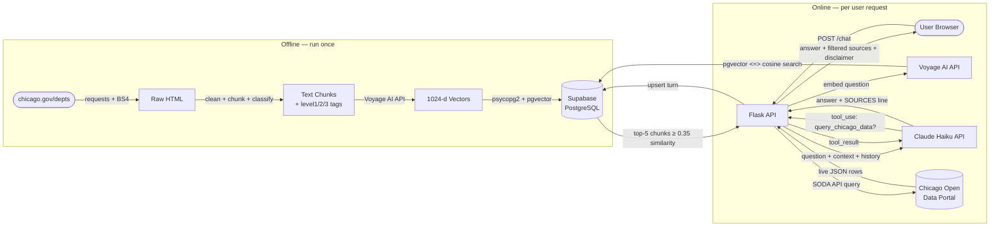
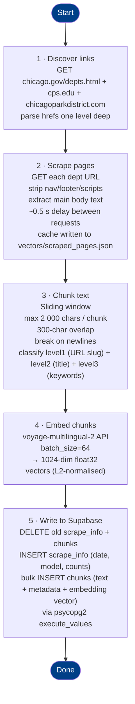
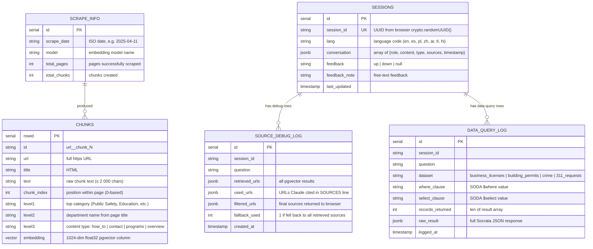

# Chicago City Services RAG Chatbot

A Retrieval-Augmented Generation (RAG) chatbot that lets users ask plain-English
questions about Chicago city services. Knowledge comes from a one-time scrape of:

- `chicago.gov/city/en/depts.html` — all city department pages
- `cps.edu` — Chicago Public Schools (up to 60 pages, one level from home)
- `chicagoparkdistrict.com` — Chicago Park District (up to 60 pages, one level from home)

Every answer carries a disclaimer with the exact scrape date so users know when
the data was last captured.

---

## Table of Contents

1. [Architecture Overview](#architecture-overview)
2. [Data Pipeline DAG](#data-pipeline-dag)
3. [Request / Response Flow](#request--response-flow)
4. [Claude Answer Logic](#claude-answer-logic)
5. [Data Model](#data-model)
6. [Project Structure](#project-structure)
7. [Setup & Running](#setup--running)
8. [Cost Model](#cost-model)
9. [Design Decisions](#design-decisions)
10. [Limitations & Future Work](#limitations--future-work)

---

## Architecture Overview



**Key principles:**
- Static knowledge (dept info, services, how-to guides) comes from Supabase via pgvector cosine search.
- Live quantitative data (crime counts, permit totals, 311 stats) comes from the Chicago Open Data Portal (Socrata SODA API) via Claude tool use — queried at inference time with no caching.
- Claude never fabricates numbers; if the Socrata query returns no rows or an error, it says so explicitly.

---

## Data Pipeline DAG

Steps that run when you execute `python scrape_and_index.py`.



---

## Request / Response Flow

Sequence of calls for a single user question.

```mermaid
sequenceDiagram
    actor User
    participant Browser
    participant Flask as Flask API (api.py)
    participant Voyage as Voyage AI API
    participant Supa as Supabase / pgvector
    participant Claude as Claude Haiku (Anthropic API)

    User->>Browser: Types question, clicks Send
    Browser->>Flask: POST /chat { "question", "lang", "history", "session_id", "clarify_count" }

    Flask->>Voyage: embed(question, input_type="query")
    Voyage-->>Flask: 1024-dim query vector

    Flask->>Supa: SELECT ... FROM chunks ORDER BY embedding <=> q_vec LIMIT 5
    Supa-->>Flask: top-5 rows with cosine similarity scores

    Note over Flask: Filter rows where similarity < 0.35

    Flask->>Claude: system prompt + retrieved context + conversation history + question
    Claude-->>Flask: answer text ending with "SOURCES: <urls>"

    Note over Flask: Strip SOURCES line; filter sources list to URLs Claude cited

    Flask->>Supa: upsert_turn (sessions table) + log_source_debug
    Flask-->>Browser: { type, answer, sources[], scrape_date, disclaimer }
    Browser-->>User: Renders answer bubble + source links + disclaimer
```

---

## Claude Answer Logic

Decision flow inside the `/chat` handler for a single request.

```mermaid
flowchart TD
    A([POST /chat received]) --> B{question empty?}
    B -- yes --> B1([400 error])
    B -- no --> C[Embed question\nVoyage AI voyage-multilingual-2]

    C --> D[pgvector cosine search\ntop-5 chunks]
    D --> E[Filter chunks\nsimilarity ≥ 0.35]

    E --> F{clarify_count ≥ 1?}
    F -- yes --> F1[Append 'do not clarify again'\nnote to user message]
    F -- no --> G
    F1 --> G[Build messages array\nsystem prompt + RAG context\n+ conversation history]

    G --> H{_parse_intent?\nClaude Haiku structured call}
    H -- is_data_query=true --> H1[tools = SOCRATA_TOOLS]
    H -- is_data_query=false --> H2[tools = empty list]
    H1 --> I
    H2 --> I

    I[1st Claude Haiku call] --> J{stop_reason?}

    J -- tool_use --> K[Extract dataset / where / select\nfrom tool_use block]
    K --> L[Query Socrata SODA API]
    L --> M{Socrata error?}
    M -- yes --> N[2nd Claude call\ntool_choice=none\nfalls back to RAG context]
    M -- no --> O[Append assistant turn +\ntool_result to messages]
    O --> P[2nd Claude call\nwith live data result]
    N --> Q
    P --> Q

    J -- max_tokens --> R([Return 'limit' response\nto browser])
    J -- end_turn --> Q

    Q{text block\nin content?}
    Q -- no --> Q1([Return graceful error\nlog warning])
    Q -- yes --> S[Extract raw text]

    S --> T{clarify_count < 2\nAND starts with 'CLARIFY:'?}
    T -- yes --> U[Return clarification\nupsert turn to DB]
    T -- no --> V[Parse SOURCES line\nstrip from answer text]

    V --> W[Filter sources to\nURLs Claude cited]
    W --> X{Any filtered sources?}
    X -- no, but chunks exist --> X1[Fallback: return all\nretrieved sources]
    X -- yes --> Y
    X1 --> Y

    Y[log_source_debug\nupsert_turn\noptionally log_data_query]
    Y --> Z([Return answer + sources\n+ scrape_date + disclaimer])

    style A fill:#003F87,color:#fff
    style Z fill:#003F87,color:#fff
    style B1 fill:#c0392b,color:#fff
    style R fill:#e67e22,color:#fff
    style Q1 fill:#c0392b,color:#fff
    style U fill:#27ae60,color:#fff
```



---

## Data Model

All data lives in **Supabase (PostgreSQL)** with the `pgvector` extension.



---

## Project Structure

```
govt-chatbot/
├── scrape_and_index.py                     ← one-time data pipeline (run before first use)
├── api.py                                  ← Flask backend + RAG logic
├── gunicorn.conf.py                        ← gunicorn worker/timeout config
├── Boundaries_-_Community_Areas*.csv       ← Chicago community area number→name mapping (from data.cityofchicago.org)
├── static/
│   └── index.html        ← two-column chat UI (vanilla JS): left info panel (1/3) + right chat (2/3)
├── vectors/
│   └── scraped_pages.json ← page cache (avoids re-scraping chicago.gov)
├── requirements.txt
├── .env                  ← ANTHROPIC_API_KEY + VOYAGE_API_KEY + DATABASE_URL + SOCRATA_APP_TOKEN (not committed)
├── .env.example          ← template with all required and optional env vars
└── project_overview.md   ← this file
```

> **Note:** There is no local `vectors.db`, `index.faiss`, `metadata.json`, or `conversations.db`.
> All persistent data (chunks, embeddings, sessions, feedback) lives in Supabase.

---

## Setup & Running

### 1 · Install dependencies

```bash
python -m venv .venv
source .venv/bin/activate       # Windows: .venv\Scripts\activate
pip install -r requirements.txt
```

### 2 · Add your API keys

```bash
cp .env.example .env
# edit .env and set:
#   ANTHROPIC_API_KEY=sk-ant-...
#   VOYAGE_API_KEY=pa-...
#   DATABASE_URL=postgresql://...  ← Supabase connection string
```

### 3 · Scrape & index (run once)

```bash
python scrape_and_index.py
```

This downloads ~40 pages from chicago.gov plus up to 60 pages each from
cps.edu and chicagoparkdistrict.com, chunks, classifies, and embeds them,
then writes all data directly to Supabase. Takes 5–10 minutes on first run
(scraping + embedding). Subsequent re-runs reuse `vectors/scraped_pages.json`
page cache for chicago.gov.

### 4 · Start the API server

```bash
python api.py
# → http://localhost:5001

# or with gunicorn (production):
# gunicorn -c gunicorn.conf.py api:app
```

### 5 · Open the chat UI

Navigate to [http://localhost:5001](http://localhost:5001) in your browser.

---

## Cost Model

| Component | Cost |
|---|---|
| Embeddings (scrape, ~500 chunks) | ~$0.05 one-time — Voyage AI API ($0.00012/1K tokens) |
| Embeddings (queries) | ~$0.00004/query — Voyage AI API |
| Vector search (pgvector on Supabase) | **~$0** — included in Supabase free tier |
| Claude Haiku — input (~3 200 tok/query) | ~$0.0026/query |
| Claude Haiku — output (~250 tok/query) | ~$0.001/query |
| **Per query total** | **~$0.0036** |

At 100 visitors/week averaging 3 questions each:

| Period | Queries | API cost |
|---|---|---|
| Week | 300 | ~$1.08 |
| Month | 1 300 | ~$4.68 |

Hosting: $0 locally or on Supabase free tier, ~$5–7/month on a small VPS (Render, Railway,
DigitalOcean).

---

## Design Decisions

| Decision | Choice | Reason |
|---|---|---|
| Embedding model | `voyage-multilingual-2` via Voyage AI API | Multilingual support; no local model download; 1024-dim vectors |
| Query vs document embedding | `input_type="query"` / `"document"` | Voyage supports asymmetric retrieval natively |
| Vector store | **pgvector on Supabase** | Replaces local FAISS — persistent, no startup load time, enables filtering by metadata columns; cosine via `<=>` operator |
| Score threshold | `similarity ≥ 0.35` | Drops clearly irrelevant chunks before sending to Claude |
| Connection pooling | `ThreadedConnectionPool(min=2, max=10)` | Reuses DB connections across concurrent Flask threads |
| Conversation storage | **Supabase `sessions` table (JSONB)** | Replaces local `conversations.db` SQLite — single source of truth, queryable |
| LLM | Claude `claude-haiku-4-5-20251001` | Fastest + cheapest Claude model; sufficient for grounded Q&A |
| Web framework | Flask + gunicorn | Minimal overhead; threaded workers handle concurrent requests |
| Scrape strategy | One-time with date disclaimer + page cache | Government content changes slowly; simpler than a scheduler; transparent to users |
| Chunk classification | level1 (URL slug), level2 (title), level3 (keywords) | Enables future filtered search by category or content type |
| Chunk size | 2 000 chars / 300-char overlap | Balances context completeness vs. prompt token cost |
| Live data | Socrata SODA API via Claude tool use | Counts/trends for 4 datasets fetched at query time; no caching needed since data changes frequently |
| Tool guard | System prompt + tool description both restrict to 4 datasets | Prevents tool misuse on school/park/transit questions that would hit Socrata with irrelevant queries; schools/parks questions use RAG context from cps.edu / chicagoparkdistrict.com instead |
| Data query sources | Override filtered_sources with Data Portal URL when data_query_meta is set | RAG (chicago.gov) sources are irrelevant for data answers; show data.cityofchicago.org + dataset URL |
| Intent parsing | `_parse_intent()` makes a lightweight Claude Haiku call (forced tool use) to extract structured intent before the main RAG call | Replaced regex keyword matching — handles all 7 languages, synonyms, and follow-up replies naturally via conversation history |
| Missing component clarification | If `is_data_query=true` but `has_time=false` or `has_location=false`, return a targeted clarification before embedding | Ensures Claude always has time + location context to form a good SODA query |
| Citywide detection | `_CITYWIDE_RE` in `_check_location_in_query` catches "all of Chicago", "citywide", etc. | Returns `status: citywide` so no community area filter is applied |
| Socrata error logging | HTTPError body now logged and returned in detail field | Enables debugging of 400 Bad Request errors from bad SODA where/select clauses |
<<<<<<< HEAD
| Socrata 400 error handling | HTTP 400 from Socrata returns an error message to the user instead of falling back to RAG | A 400 indicates a bad query (invalid field/syntax); RAG fallback would silently hide the failure and give a confusing answer |
=======
>>>>>>> b3e3ea2 (Sync with main)
| Community area CSV | Boundaries_-_Community_Areas*.csv loaded at startup | Provides name→number and number→name lookup for all 77 Chicago community areas |
| Location pre-flight | _check_location_in_query() runs before Voyage embed on data queries | If user mentions an invalid neighborhood, returns clarification with full list before any API call |
| Community area injection | Resolved area number injected into user_content as a [LOCATION NOTE] | Guarantees Claude uses bare integer (e.g. community_area=28) not a quoted name in the WHERE clause |
| Server-side translation | _translate_community_areas_in_where() applied to Claude's WHERE clause | Safety net: swaps any remaining quoted area name to its number before hitting Socrata |
<<<<<<< HEAD
| Anthropic overload retry + fallback | `_claude_create()` wraps all `client.messages.create` calls with exponential-backoff retry (up to 3 attempts, 2s/4s delays) on HTTP 529; if Haiku is still overloaded after all retries, falls back to `claude-sonnet-4-6` for one final attempt | Anthropic occasionally returns 529 OverloadedError under high load; retrying + falling back to Sonnet avoids user-facing errors during Haiku capacity spikes |
=======
>>>>>>> b3e3ea2 (Sync with main)

---

## Live Data — Chicago Open Data Portal (Socrata)

Four datasets are queryable in real time via Claude tool use:

| Key | Dataset ID | Example questions |
|---|---|---|
| `business_licenses` | `r5kz-chrr` | How many businesses opened in Logan Square in 2023? |
| `building_permits` | `ydr8-5enu` | How many permits were issued in Ward 32 last year? |
| `crime` | `ijzp-q8t2` | How many robberies in 2024? |
| `311_requests` | `v6vf-nfxy` | What are the most common 311 requests? |

Claude only calls the `query_chicago_data` tool when the question is explicitly about one of these four topics. For other quantitative questions (schools, parks, transit, health) it falls back to the RAG context.

Optional env var: `SOCRATA_APP_TOKEN` raises the anonymous rate limit from 1 req/s → 10 req/s. Register free at data.cityofchicago.org.

The `data_query_log` table in Supabase records every tool call for observability.

---

## Limitations & Future Work

- **Stale data** — re-run `scrape_and_index.py` manually to refresh. A cron job
  could automate this monthly.
- **JavaScript-rendered pages** — `requests` + BeautifulSoup only sees server-rendered
  HTML. Any dept page that loads content via JS will be partially scraped.
  Replace with `playwright` if needed.
- **Inline URL linkification** — answer text is passed through `linkify()` before being inserted as `innerHTML`. The function HTML-escapes the text, then wraps bare `https?://` URLs in `<a target="_blank">` tags so any chicago.gov links Claude mentions become clickable directly inside the chat bubble.
- **Source filtering** — Claude appends a `SOURCES: <urls>` line to every answer. The backend strips that line from the displayed text and uses it to filter the pgvector-retrieved sources list down to only the pages Claude actually drew from.
- **Conversation logging** — every `/chat` turn (question + answer, including clarifications) is upserted into the `sessions` table in Supabase. Schema: `session_id, lang, conversation (JSONB array), feedback, feedback_note, last_updated`. The `session_id` is a UUID generated once per page load in the browser (`crypto.randomUUID()`), allowing multi-turn sessions to be grouped.
- **Source debug logging** — every request logs retrieved vs. used vs. filtered URLs to `source_debug_log` for observability.
- **Session memory** — the frontend maintains a `conversationHistory` array (`[{role, content}]`) in JavaScript memory. Each turn is appended after a successful response. The full history is sent to `/chat` on every request so Claude sees the whole conversation. History is lost when the tab is closed (no persistence). The frontend also tracks `consecutiveClarifyCount`; after 1 consecutive clarification Claude is instructed to answer or say "I don't know" with relevant links.
- **Multilingual** — Language selector (English, Español, Polski, 中文, العربية, Tagalog, हिन्दी) is live. The frontend passes `lang` to `/chat`; Claude is instructed to reply in the chosen language. The embedding model (`voyage-multilingual-2`) handles multilingual queries natively. RTL layout is applied automatically for Arabic.
- **No auth** — fine for a public civic tool; add API key middleware if you
  want to rate-limit or restrict access.
- **Feedback strip** — thin banner below the chat input showing "Find this helpful? 👍 👎". Feedback type and optional note are stored in the `sessions` table in Supabase via the `/feedback` endpoint.
